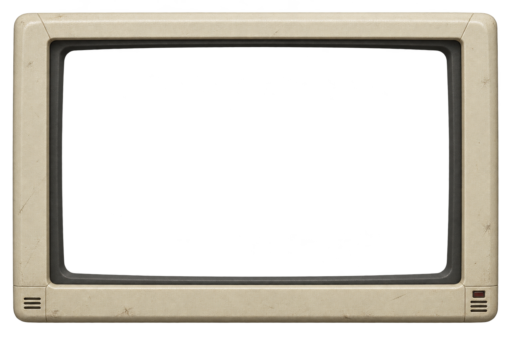

# Monitor frame concept v1

Status: integrated as the optional demo frame using a CSS nine-slice border. Generated 2026-09-12 with the built-in ImageGen tool; the original prompt and master remain here as design history. See [MVP validation](../validation.md) for browser and layout checks.



## Intended use

Use the assembled master image as a CSS nine-slice border: four fixed corners and four stretchable edges around the live terminal. The center is left empty. This follows the requested eight-panel idea without generating eight pieces with potentially inconsistent lighting and seams.

The frame is restrained aged ivory polymer with a dark inset lip, designed to contrast with the terminal's Amber, Green Phosphor, and Color CRT themes. Keep it in the demo; the published terminal component should not require this asset.

The PNG is 1536 × 1024 with an alpha channel. Pixel inspection confirmed transparent pixels at the central aperture and exterior, and near-opaque pixels on the bezel. Generation supplied real alpha rather than merely a painted checkerboard. The demo uses fixed corner slices and stretchable edges, with the center left transparent over the live terminal. Browser and responsive layout checks are recorded in [MVP validation](../validation.md). Do not stretch the image as a single rectangle or put its center over the terminal.

## Exact generation prompt

```text
Use case: product-mockup
Asset type: concept artwork for the decorative border of a retro terminal web demo, designed as one continuous master image for CSS nine-slice borders (four corners plus four stretchable edges, with an empty center).
Primary request: a beautifully tactile, restrained early-1980s CRT monitor bezel, seen exactly head-on in orthographic projection. Only the frame is present. The actual terminal screen will be rendered separately by software.
Scene/backdrop: genuinely transparent alpha background outside the frame AND genuinely transparent alpha through the large central screen aperture. Do not paint a checkerboard or any flat background in these transparent regions.
Subject: one uninterrupted rectangular monitor frame with softly rounded external corners, warm aged ivory molded resin, very fine stippled plastic texture, subtle believable wear, a narrow dark graphite recessed inner lip. A very small unlit indicator recess and a few discreet ventilation slits may sit fully inside the lower corner pieces. Elegant, compact, authentic hardware detail, not bulky or cartoonish.
Composition/framing: landscape canvas, approximately 3:2. Frame fully visible with a little transparent margin. Large central opening occupies most of the image. Strict horizontal and vertical straight edges, symmetric geometry, absolutely no perspective or tilt. Moderate uniform frame thickness. Keep the middle sections of all four edges simple and continuous so they can stretch independently; put distinctive details only near corners. Corners are intended to remain unscaled.
Lighting/mood: soft neutral studio illumination, gentle dimensional shading baked only into the bezel, no dramatic directional shadows, no colored screen glow.
Materials/textures: realistic molded polymer, understated age and tactile detail.
Text: no text, no lettering, no logos, no numbers.
Constraints: one assembled frame, not an exploded diagram or multiple separate assets. No screen content, no glass covering the central hole, no reflections across the center, no stand, no keyboard, no desk, no cables, no environment, no watermark. Preserve a clean transparent central aperture for a live terminal canvas. This is a design exploration, not an exact replica of any branded monitor.
```

No reference images or CLI/API fallback were used. The selected generated master was copied into this directory unchanged.
