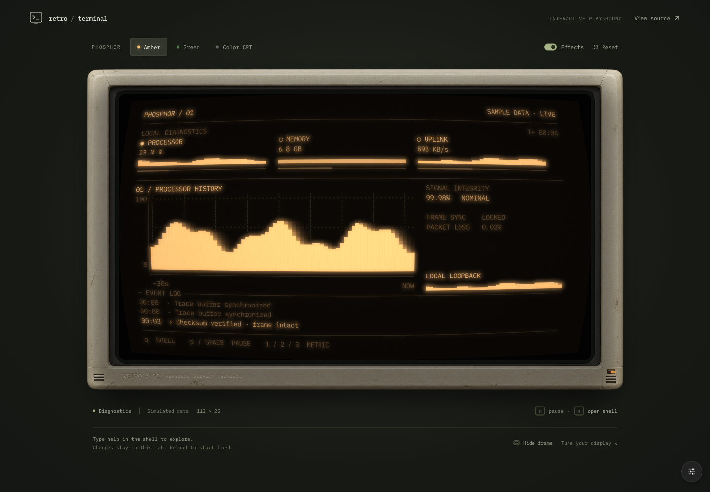

# Retro Web Terminal

An embeddable React terminal with real-time CRT effects: phosphor glow, curved glass, scanlines, fading trails, color separation, grain, flicker, and glitches. Built on xterm.js and WebGL2, with Amber, Green Phosphor, and Color CRT presets.

[](https://retro-web-terminal.vercel.app/)

The browser playground opens into an animated diagnostics dashboard. Press Esc or click **Exit demo** for a local shell, try `help`, and run `demo` to return. All dashboard data is simulated. **Reset** clears the terminal session, restores the current theme settings, and restarts the demo. Reload also starts fresh.

## Embed in React

Install the package from npm in your React 18+ app:

```sh
pnpm add retro-web-terminal
```

Import the stylesheet once and give the component a height. Browser resources are created after mounting; use a client component in server-rendered frameworks.

```tsx
import { useRef } from 'react'
import { RetroTerminal, type RetroTerminalHandle } from 'retro-web-terminal'
import 'retro-web-terminal/styles.css'

export function TerminalExample() {
  const terminal = useRef<RetroTerminalHandle>(null)

  return (
    <RetroTerminal
      ref={terminal}
      theme='amber'
      style={{ height: 420 }}
      settings={{ curvature: { amount: 0.06 } }}
      onReady={(handle) => {
        handle.write('Welcome to the terminal\r\n')
        handle.focus()
      }}
      onData={(data) => terminal.current?.write(data)}
    />
  )
}
```

This example echoes input. Connect `onData`, `onResize`, and `write()` to your own terminal transport for a real session. The reusable package does not include the demo shell, controls, fonts, or frame. It uses a system monospace fallback; load IBM Plex Mono yourself to match the demo.

The ref exposes `write`, `focus`, `clear`, `getSize`, and `getSelection`. `onReady` can return a cleanup function. Settings use TypeScript types and JSON presets; nested overrides merge with the selected preset without runtime validation or clamping. Theme and setting changes preserve terminal contents. See the [component and renderer guide](docs/architecture.md) for the complete contract and integration limits.

## Run the demo locally

Clone this repository, then use Node 24.11+ or 26+ and pnpm from the repository root.

```sh
pnpm install
pnpm dev
```

Open the address printed by Vite. Tune the display with the control button at the lower right. The optional monitor frame belongs only to the demo.

```sh
pnpm fix:format
pnpm fix:lint
pnpm test
pnpm build
pnpm exec playwright install
pnpm test:browser
```

## Deploy the demo to Vercel

Import the repository with Root Directory left empty. The checked-in `vercel.json` runs the workspace build and publishes `apps/demo/dist`. No environment variables are required.

## Browser support

Current desktop Chromium, Firefox, and Safari are the intended baseline. Effects need WebGL2. If GPU initialization fails or a graphics context is lost, the same session continues in xterm's ordinary renderer. Reduced motion suppresses grain, flicker, and glitches. Extreme settings are intentionally experimental.

See [validation results](docs/validation.md) for tested browser engines, actual frame timing, and remaining manual checks. [Demo runtime](docs/demo-runtime.md) documents the in-memory filesystem and buffered shell behavior. [Credits](docs/credits.md) covers dependencies, fonts, and artwork.

MIT license. Inspired by the visual character of cool-retro-term; the shaders are original implementations.
